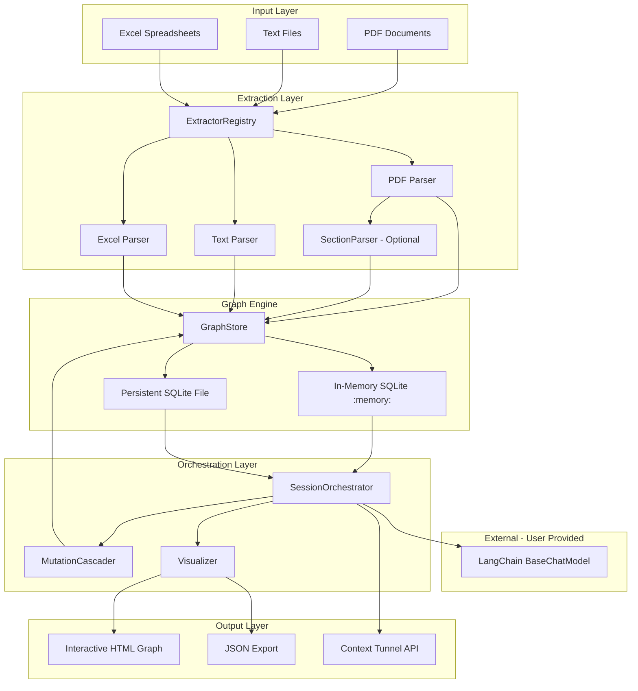
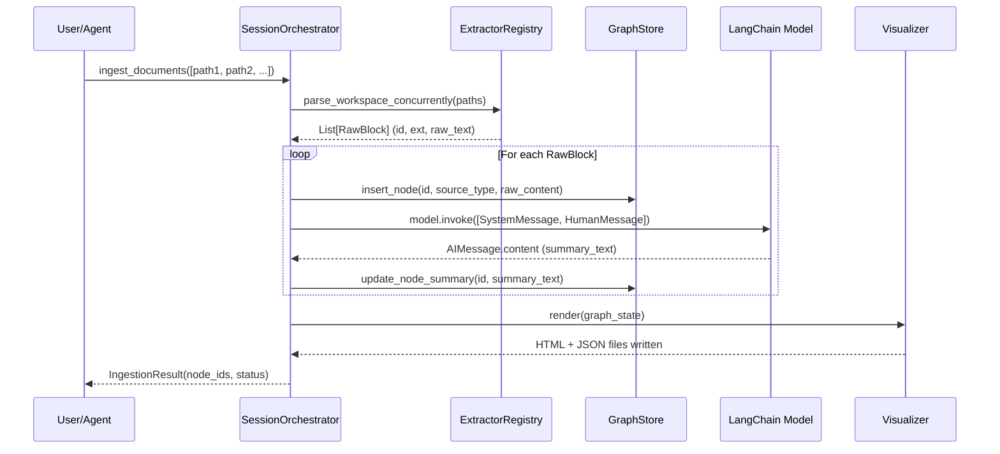
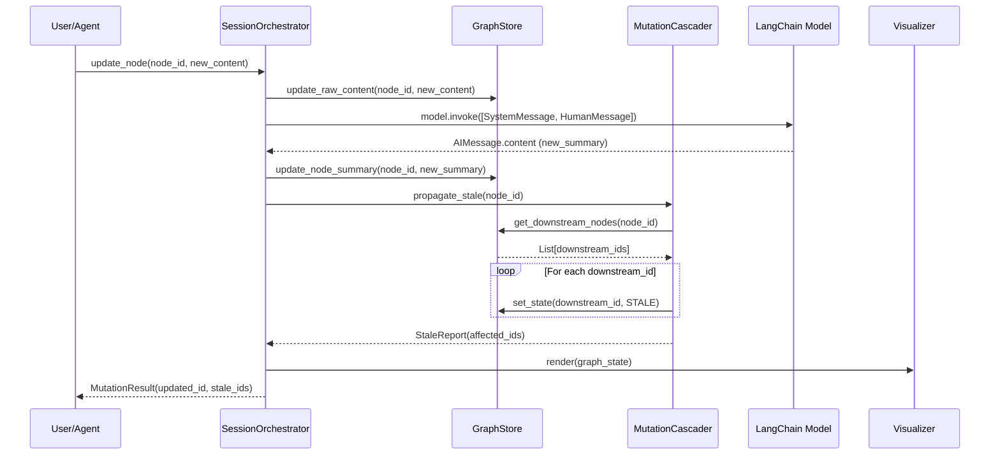
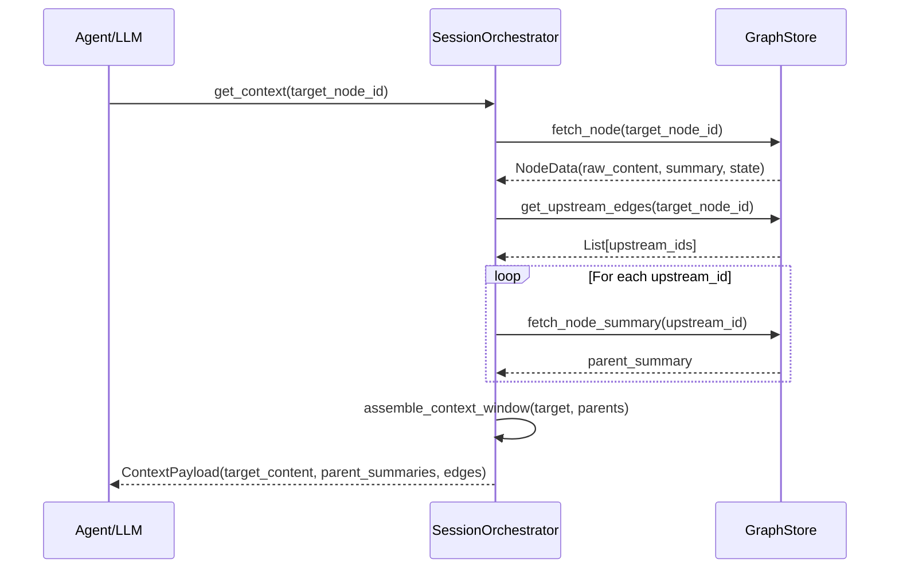
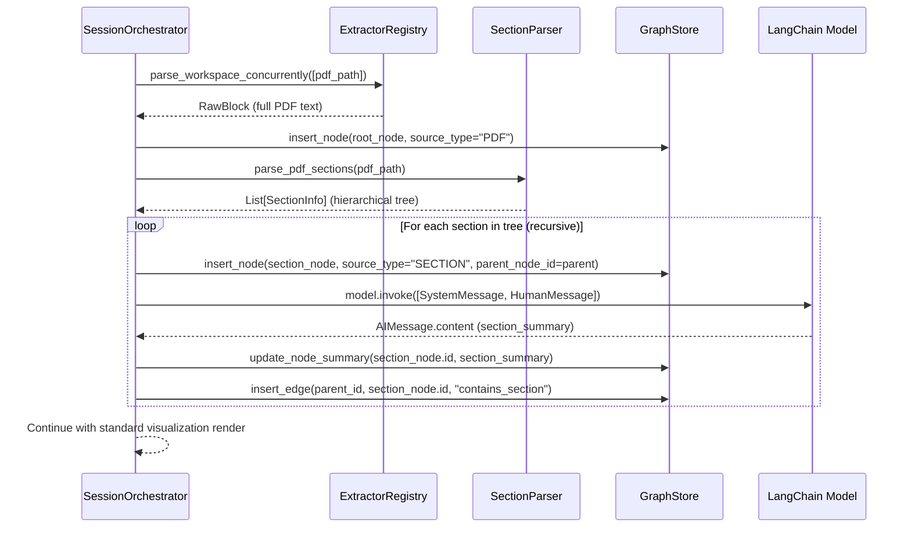
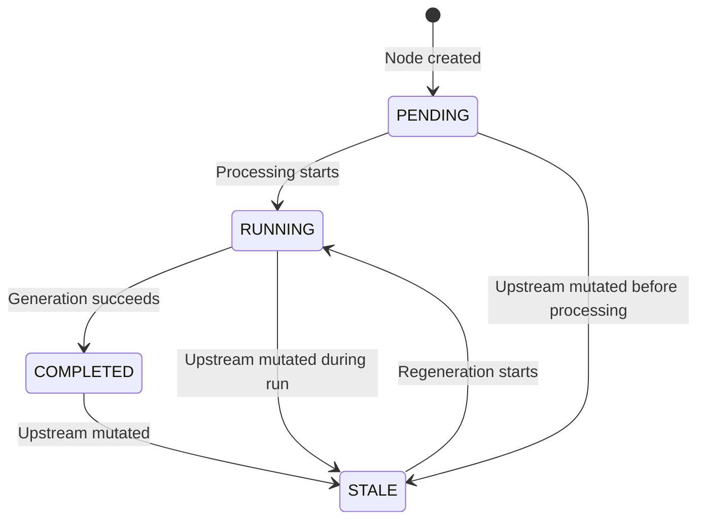

# Design Document: CogniLink

## Overview

CogniLink is a dual-engine stateful context middleware for multi-agent systems that maintains a graph of workspace data blocks (nodes) and their directed relationships (edges), with support for both ephemeral in-memory sessions and persistent SQLite storage. The system ingests documents (PDFs, text files, Excel spreadsheets) through a plugin-based extractor registry, summarizes content via any LangChain-compatible chat model (`BaseChatModel` from `langchain-core`) — the user brings their own configured model instance (OpenAI, Bedrock, Ollama, Anthropic, Azure, Google, etc.) — and implements real-time mutation cascading when upstream nodes change.

The system outputs an interactive HTML visualization (replacing the traditional Markdown ledger) powered by vis.js for clickable, color-coded graph exploration, alongside a JSON export for programmatic consumption. The architecture separates concerns into three layers: ingestion (zero-token programmatic extraction), graph storage (in-memory or persistent SQLite with relationship tracking), and orchestration (LLM invocation via user-provided LangChain model, mutation detection, cascade propagation, and visualization rendering). CogniLink does NOT manage LLM connections — the user passes a configured LangChain model and CogniLink calls `model.invoke()` with the right prompts. This design targets Python 3.11+ as an open-source pip-installable package published to PyPI as `cognilink`.

## Architecture



## Sequence Diagrams

### Document Ingestion Flow



### Mutation Cascade Flow



### Context Retrieval Flow



## Components and Interfaces

### Component 1: ExtractorRegistry

**Purpose**: Plugin-based file parser registry that enables concurrent multi-threaded extraction of raw text from heterogeneous document formats with zero LLM token consumption.

**Interface**:
```python
from typing import Callable, Dict, List, Any

class ExtractorRegistry:
    def __init__(self) -> None: ...
    def register_parser(self, extension: str, parser_fn: Callable[[str], str]) -> None: ...
    def parse_workspace_concurrently(self, paths: List[str]) -> List[Dict[str, Any]]: ...
    def get_registered_extensions(self) -> List[str]: ...
```

**Responsibilities**:
- Maintain a mapping of file extensions to parser callables
- Execute extraction in parallel using ThreadPoolExecutor
- Provide a fallback plain-text reader for unregistered extensions
- Generate deterministic node IDs from file paths

### Component 2: GraphStore

**Purpose**: SQLite database wrapper managing the nodes and edges tables, supporting both ephemeral in-memory (`:memory:`) and persistent on-disk storage modes. Provides CRUD operations with transactional safety and relationship traversal queries.

**Interface**:
```python
from typing import Optional, List
from dataclasses import dataclass
from enum import Enum
from pathlib import Path

class NodeState(Enum):
    PENDING = "PENDING"
    RUNNING = "RUNNING"
    COMPLETED = "COMPLETED"
    STALE = "STALE"

@dataclass
class Node:
    id: str
    source_type: str
    source_path: str
    raw_content: str
    summary: str
    system_role_prompt: str
    output_artifact: Optional[str]
    state: NodeState
    parent_node_id: Optional[str] = None   # For section hierarchy within a document
    page_start: Optional[int] = None       # Starting page (section-level parsing)
    page_end: Optional[int] = None         # Ending page (section-level parsing)

@dataclass
class Edge:
    id: int
    upstream_id: str
    downstream_id: str
    relationship_type: str

class GraphStore:
    def __init__(self, persist: bool = False, db_path: Optional[Path] = None) -> None: ...
    def insert_node(self, node: Node) -> None: ...
    def get_node(self, node_id: str) -> Optional[Node]: ...
    def update_node(self, node_id: str, **fields) -> None: ...
    def delete_node(self, node_id: str) -> None: ...
    def insert_edge(self, upstream_id: str, downstream_id: str, relationship_type: str) -> Edge: ...
    def get_downstream(self, node_id: str) -> List[Edge]: ...
    def get_upstream(self, node_id: str) -> List[Edge]: ...
    def delete_edge(self, edge_id: int) -> None: ...
    def get_all_nodes(self) -> List[Node]: ...
    def get_all_edges(self) -> List[Edge]: ...
    def set_node_state(self, node_id: str, state: NodeState) -> None: ...
    def close(self) -> None: ...
```

**Responsibilities**:
- Initialize SQLite with schema on construction (in-memory or file-based depending on `persist` flag)
- Wrap all mutations in transaction blocks for atomicity
- Provide indexed lookups for upstream/downstream traversal
- Enforce foreign key constraints and state enum validation
- When `persist=True`, store to a SQLite file that survives session termination
- When `persist=False` (default), use `:memory:` for ephemeral session-scoped storage

### Component 3: LangChain Model Integration

**Purpose**: CogniLink accepts any LangChain `BaseChatModel` instance from the user. The user configures their own model (from `langchain-openai`, `langchain-aws`, `langchain-community`, `langchain-anthropic`, etc.) and passes it to CogniLink. CogniLink simply calls `model.invoke()` with the appropriate prompts. No custom LLM abstraction layer needed.

**Interface**:
```python
from langchain_core.language_models import BaseChatModel
from langchain_core.messages import SystemMessage, HumanMessage, AIMessage

# CogniLink does NOT define an LLM class. The user passes their model directly.
# Internally, CogniLink calls the model like this:

def _invoke_model(model: BaseChatModel, system_prompt: str, user_prompt: str) -> str:
    """
    Internal helper to invoke the user-provided LangChain model.
    
    Args:
        model: Any LangChain BaseChatModel instance (ChatOpenAI, ChatBedrock, ChatOllama, etc.)
        system_prompt: The system-level instruction for the model.
        user_prompt: The user-level input/content to process.
    
    Returns:
        The generated text content from the model's response.
    """
    messages = [
        SystemMessage(content=system_prompt),
        HumanMessage(content=user_prompt),
    ]
    response: AIMessage = model.invoke(messages)
    return response.content
```

**Responsibilities**:
- Accept any `BaseChatModel` instance from the user (CogniLink does not manage connections)
- Call `model.invoke([SystemMessage(...), HumanMessage(...)])` for all LLM interactions
- Extract text from `AIMessage.content` in the response
- Handle LangChain exceptions gracefully (timeouts, auth errors, rate limits)
- No provider-specific code — LangChain handles all routing internally

### Component 4: MutationCascader

**Purpose**: Implements the real-time downstream propagation logic — when a node is mutated, traverses the edge graph to mark all transitive dependents as STALE.

**Interface**:
```python
from typing import List, Set
from dataclasses import dataclass

@dataclass
class CascadeReport:
    source_node_id: str
    stale_node_ids: List[str]
    depth_reached: int

class MutationCascader:
    def __init__(self, graph_store: GraphStore) -> None: ...
    def propagate_stale(self, mutated_node_id: str) -> CascadeReport: ...
    def get_regeneration_order(self, stale_ids: List[str]) -> List[str]: ...
    def regenerate_node(self, node_id: str, model: BaseChatModel) -> None: ...
```

**Responsibilities**:
- Perform BFS/DFS traversal from mutated node through downstream edges
- Detect and handle cycles in the dependency graph
- Mark all reachable downstream nodes as STALE
- Compute topological regeneration order for selective re-generation
- Coordinate with user-provided LangChain model to regenerate stale node outputs

### Component 5: Visualizer

**Purpose**: Renders the graph state as an interactive HTML visualization (using vis.js) and a machine-readable JSON export. Replaces the previous Markdown ledger approach with a rich, clickable graph UI.

**Interface**:
```python
from pathlib import Path
from typing import Dict, Any

class Visualizer:
    def __init__(self, output_dir: Path, graph_store: GraphStore) -> None: ...
    def render_html(self) -> Path: ...
    def export_json(self) -> Path: ...
    def render(self) -> Dict[str, Path]: ...
```

**Responsibilities**:
- Render a self-contained HTML file with embedded vis.js for interactive graph exploration
- Color-code nodes by state: green (COMPLETED), yellow (RUNNING), red (STALE), gray (PENDING)
- Display edge labels showing relationship types
- Support clickable nodes that reveal node details (summary, source, state)
- Export a JSON file containing the full graph structure for programmatic consumption
- Use Jinja2 templates for HTML generation
- `render()` produces both HTML and JSON outputs in a single call

### Component 6: SessionOrchestrator

**Purpose**: Top-level coordinator that wires together all components, exposes the public API, and manages the session lifecycle.

**Interface**:
```python
from typing import List, Optional, Dict, Any
from pathlib import Path
from dataclasses import dataclass

@dataclass
class SessionConfig:
    model: BaseChatModel                # Any LangChain chat model (ChatOpenAI, ChatBedrock, ChatOllama, etc.)
    workspace_path: Path
    persist: bool = False
    db_path: Optional[Path] = None
    auto_cascade: bool = True
    section_mode: bool = False          # When True, PDFs are parsed into hierarchical section nodes
    default_prompt: str = "Summarize the following document in 2-3 sentences."

@dataclass
class IngestionResult:
    node_ids: List[str]
    edges_created: int
    status: str

@dataclass
class ContextPayload:
    target_node: Node
    parent_summaries: List[Dict[str, str]]
    relationship_chain: List[Edge]

class SessionOrchestrator:
    def __init__(self, config: SessionConfig) -> None: ...
    def ingest_documents(self, paths: List[str], relationships: Optional[List[Dict[str, str]]] = None) -> IngestionResult: ...
    def update_node(self, node_id: str, new_content: str) -> CascadeReport: ...
    def add_edge(self, upstream_id: str, downstream_id: str, relationship_type: str) -> Edge: ...
    def get_context(self, target_node_id: str) -> ContextPayload: ...
    def regenerate_stale(self) -> List[str]: ...
    def render_visualization(self) -> Dict[str, Path]: ...
    def get_graph_state(self) -> Dict[str, Any]: ...
    def close(self) -> None: ...
```

**Responsibilities**:
- Coordinate the full ingestion pipeline (extract → store → summarize via user-provided LangChain model → link)
- Delegate mutations to GraphStore and trigger cascades via MutationCascader
- Assemble bounded context windows for agent consumption
- Manage visualization rendering after state changes
- Provide a clean public API for agent integration
- Handle session lifecycle (open/close, persist/ephemeral)

### Component 7: SectionParser (Optional — PageIndex-style Hierarchical Parsing)

**Purpose**: When `section_mode=True`, parses PDF documents into a hierarchical tree of section nodes rather than treating the entire PDF as a single node. Inspired by PageIndex's approach to document structure extraction, but integrated with CogniLink's mutable graph model (sections cascade to STALE on mutation, cross-document section linking is supported).

**Interface**:
```python
from typing import List, Optional
from dataclasses import dataclass

@dataclass
class SectionInfo:
    title: str
    content: str
    level: int              # Heading depth (1 = top-level, 2 = sub-section, etc.)
    page_start: int
    page_end: int
    children: List["SectionInfo"]

class SectionParser:
    def __init__(self, model: BaseChatModel) -> None: ...
    def parse_pdf_sections(self, pdf_path: str) -> List[SectionInfo]: ...
    def detect_headings(self, pdf_path: str) -> List[Dict[str, Any]]: ...
    def build_section_tree(self, headings: List[Dict[str, Any]], full_text: str) -> List[SectionInfo]: ...
    def create_section_nodes(
        self,
        sections: List[SectionInfo],
        parent_node_id: str,
        source_path: str,
        graph_store: GraphStore
    ) -> List[str]: ...
    def summarize_section(self, section: SectionInfo) -> str: ...
```

**Responsibilities**:
- Detect headings/sections in PDF via font size analysis or Table of Contents extraction
- Build a recursive tree of sections and sub-sections from detected headings
- Create child nodes for each section linked to a parent "document root" node
- Generate per-section summaries using the user-provided LangChain model
- Create `contains_section` edges from parent sections to child sections
- Assign `page_start` and `page_end` to each section node
- Support cross-document section linking (a section in PDF_A can link to a section in PDF_B via standard edge creation)

**Key Differences from PageIndex**:
- **Mutable sections**: Unlike PageIndex's read-only tree, CogniLink sections are mutable — updating a section cascades STALE to child sections via the existing MutationCascader
- **Cross-document linking**: PageIndex operates within a single document. CogniLink's graph model allows edges between sections across different documents
- **Graph traversal retrieval**: PageIndex uses tree search. CogniLink uses graph traversal + bounded context for retrieval, meaning section nodes participate in the same `get_context()` API

**Section Ingestion Flow** (when `section_mode=True`):


## Data Models

### Node Model

```python
@dataclass
class Node:
    id: str                          # Deterministic ID: NODE_{FILENAME_UPPER}
    source_type: str                 # PDF | TEXT | EXCEL | SECTION | CUSTOM
    source_path: str                 # Original file path or URI
    raw_content: str                 # Full extracted text (programmatic, 0 tokens)
    summary: str                     # 2-3 sentence LLM-generated summary
    system_role_prompt: str          # Default system prompt for this node type
    output_artifact: Optional[str]   # Generated code/docs stored here
    state: NodeState                 # PENDING | RUNNING | COMPLETED | STALE
    parent_node_id: Optional[str]    # For section hierarchy (None for top-level nodes)
    page_start: Optional[int]        # Starting page number (section-level parsing)
    page_end: Optional[int]          # Ending page number (section-level parsing)
```

**Validation Rules**:
- `id` must be non-empty, uppercase, prefixed with `NODE_`
- `source_type` must be one of the allowed enum values (PDF, TEXT, EXCEL, SECTION, CUSTOM)
- `source_path` must be a valid file path or URI
- `raw_content` must be non-empty after extraction
- `summary` must be non-empty after summarization pass
- `state` transitions: PENDING → RUNNING → COMPLETED; any state → STALE
- `parent_node_id`, if set, must reference an existing node in the graph
- `page_start` and `page_end`, if set, must satisfy `page_start <= page_end`

### Edge Model

```python
@dataclass
class Edge:
    id: int                    # Auto-incremented integer
    upstream_id: str           # FK to nodes.id (the dependency)
    downstream_id: str         # FK to nodes.id (the dependent)
    relationship_type: str     # Semantic label: 'defines_logic_for', 'must_comply_with', etc.
```

**Validation Rules**:
- `upstream_id` and `downstream_id` must reference existing nodes
- `upstream_id` != `downstream_id` (no self-edges)
- `relationship_type` must be a non-empty descriptive string
- Duplicate edges (same upstream, downstream, type) are rejected

### State Transition Diagram



### Dual-Lifetime Storage Model

```mermaid
graph LR
    subgraph Ephemeral Mode - persist=False
        EM[SQLite :memory:]
        EM -->|Session ends| DEL[Auto-deleted]
    end

    subgraph Persistent Mode - persist=True
        PM[SQLite File on Disk]
        PM -->|Session ends| SAVE[Data preserved]
        SAVE -->|Future session| LOAD[Load existing graph]
    end
```

**Ephemeral Mode** (default):
- `GraphStore(persist=False)` → uses `:memory:` SQLite
- Graph exists only for the lifetime of the Python process
- Ideal for single-session agent workflows

**Persistent Mode**:
- `GraphStore(persist=True, db_path=Path("./cognilink.db"))` → uses file-based SQLite
- Graph survives process termination and can be reloaded in future sessions
- Ideal for long-term RAG pipelines, multi-session projects, and knowledge bases

## Algorithmic Pseudocode

### Algorithm 1: Document Ingestion Pipeline

```python
def ingest_documents(
    self,
    paths: List[str],
    relationships: Optional[List[Dict[str, str]]] = None
) -> IngestionResult:
    """
    Full ingestion pipeline: extract → store → summarize → link → visualize.
    
    Preconditions:
        - All paths point to existing, readable files
        - File extensions are either registered or fallback-readable as UTF-8
        - LLM provider (user-provided LangChain model) is reachable
    
    Postconditions:
        - One Node per path exists in GraphStore with state COMPLETED
        - Each node has a non-empty summary generated by LLM
        - All specified relationships are stored as edges
        - HTML visualization and JSON export are updated
        - Returns IngestionResult with all created node IDs
    """
    # Phase 1: Concurrent extraction (0 LLM tokens)
    raw_blocks = self.extractor.parse_workspace_concurrently(paths)
    
    node_ids = []
    for block in raw_blocks:
        # Phase 2: Store raw content
        node = Node(
            id=block["id"],
            source_type=self._infer_source_type(block["ext"]),
            source_path=block["path"],
            raw_content=block["raw_text"],
            summary="",
            system_role_prompt=self._get_default_prompt(block["ext"]),
            output_artifact=None,
            state=NodeState.PENDING
        )
        self.graph_store.insert_node(node)
        
        # Phase 3: LLM summarization via LangChain model
        self.graph_store.set_node_state(node.id, NodeState.RUNNING)
        from langchain_core.messages import SystemMessage, HumanMessage
        response = self.model.invoke([
            SystemMessage(content=self.config.default_prompt),
            HumanMessage(content=node.raw_content[:4000])  # Bounded input
        ])
        self.graph_store.update_node(node.id, summary=response.content)
        self.graph_store.set_node_state(node.id, NodeState.COMPLETED)
        node_ids.append(node.id)
    
    # Phase 4: Edge creation
    edges_created = 0
    if relationships:
        for rel in relationships:
            self.graph_store.insert_edge(
                upstream_id=rel["upstream"],
                downstream_id=rel["downstream"],
                relationship_type=rel["type"]
            )
            edges_created += 1
    
    # Phase 5: Visualization render
    self.visualizer.render()
    
    return IngestionResult(node_ids=node_ids, edges_created=edges_created, status="OK")
```

### Algorithm 2: Mutation Cascade Propagation

```python
def propagate_stale(self, mutated_node_id: str) -> CascadeReport:
    """
    BFS traversal from mutated node marking all downstream dependents STALE.
    
    Preconditions:
        - mutated_node_id exists in GraphStore
        - mutated_node_id has already been updated with new content
    
    Postconditions:
        - All transitively reachable downstream nodes have state == STALE
        - No upstream nodes are affected
        - Cycle detection prevents infinite traversal
        - Returns CascadeReport with all affected node IDs and max depth
    
    Loop Invariants:
        - visited set contains exactly the nodes already processed
        - queue contains only unvisited downstream nodes
        - All nodes in visited have been marked STALE (except source)
    """
    visited: Set[str] = set()
    queue: List[str] = [mutated_node_id]
    stale_ids: List[str] = []
    depth = 0
    
    while queue:
        next_level: List[str] = []
        for current_id in queue:
            if current_id in visited:
                continue  # Cycle detection
            visited.add(current_id)
            
            downstream_edges = self.graph_store.get_downstream(current_id)
            for edge in downstream_edges:
                child_id = edge.downstream_id
                if child_id not in visited:
                    self.graph_store.set_node_state(child_id, NodeState.STALE)
                    stale_ids.append(child_id)
                    next_level.append(child_id)
        
        queue = next_level
        if next_level:
            depth += 1
    
    return CascadeReport(
        source_node_id=mutated_node_id,
        stale_node_ids=stale_ids,
        depth_reached=depth
    )
```

### Algorithm 3: Topological Regeneration Order

```python
def get_regeneration_order(self, stale_ids: List[str]) -> List[str]:
    """
    Compute topological sort of stale nodes for correct regeneration sequence.
    
    Preconditions:
        - All stale_ids exist in GraphStore
        - All stale_ids have state == STALE
    
    Postconditions:
        - Returns list where for any edge (A→B), A appears before B
        - If graph has cycles among stale nodes, raises CycleDetectedError
        - All stale_ids appear exactly once in output
    
    Loop Invariants:
        - in_degree[node] == number of unprocessed upstream dependencies
        - result contains only nodes whose dependencies are all resolved
    """
    stale_set = set(stale_ids)
    in_degree: Dict[str, int] = {nid: 0 for nid in stale_ids}
    
    # Build in-degree map restricted to stale subgraph
    for nid in stale_ids:
        upstream_edges = self.graph_store.get_upstream(nid)
        for edge in upstream_edges:
            if edge.upstream_id in stale_set:
                in_degree[nid] += 1
    
    # Kahn's algorithm
    queue = [nid for nid, deg in in_degree.items() if deg == 0]
    result: List[str] = []
    
    while queue:
        current = queue.pop(0)
        result.append(current)
        
        downstream_edges = self.graph_store.get_downstream(current)
        for edge in downstream_edges:
            if edge.downstream_id in stale_set:
                in_degree[edge.downstream_id] -= 1
                if in_degree[edge.downstream_id] == 0:
                    queue.append(edge.downstream_id)
    
    if len(result) != len(stale_ids):
        raise CycleDetectedError(
            f"Cycle detected among stale nodes. Resolved {len(result)}/{len(stale_ids)}"
        )
    
    return result
```

### Algorithm 4: Context Window Assembly

```python
def get_context(self, target_node_id: str) -> ContextPayload:
    """
    Assemble a bounded context window for agent consumption.
    
    Preconditions:
        - target_node_id exists in GraphStore
        - target node state is not PENDING (has been processed)
    
    Postconditions:
        - Returns ContextPayload with target node's full content
        - Includes summaries (not full content) of all direct upstream parents
        - Includes the relationship chain connecting parents to target
        - Total assembled text fits within configurable token budget
    
    Loop Invariants:
        - parent_summaries contains only summaries from direct upstream nodes
        - No duplicate parent entries
    """
    target_node = self.graph_store.get_node(target_node_id)
    if target_node is None:
        raise NodeNotFoundError(f"Node {target_node_id} not found")
    
    upstream_edges = self.graph_store.get_upstream(target_node_id)
    parent_summaries: List[Dict[str, str]] = []
    
    for edge in upstream_edges:
        parent_node = self.graph_store.get_node(edge.upstream_id)
        if parent_node is not None:
            parent_summaries.append({
                "node_id": parent_node.id,
                "summary": parent_node.summary,
                "relationship": edge.relationship_type
            })
    
    return ContextPayload(
        target_node=target_node,
        parent_summaries=parent_summaries,
        relationship_chain=upstream_edges
    )
```

### Algorithm 5: HTML Visualization Render

```python
def render_html(self) -> Path:
    """
    Render the complete graph state as an interactive HTML file using vis.js.
    
    Preconditions:
        - self.output_dir is a writable directory path
        - GraphStore is in a consistent state (no active transactions)
        - Jinja2 template exists at templates/graph.html
    
    Postconditions:
        - A self-contained HTML file is written to output_dir/cognilink_graph.html
        - HTML includes embedded vis.js library (no external CDN dependency)
        - Nodes are color-coded: green=COMPLETED, yellow=RUNNING, red=STALE, gray=PENDING
        - Edges display relationship_type as labels
        - Clicking a node reveals its details (summary, source_path, state)
        - File is atomically written (write to temp, then rename)
    """
    nodes = self.graph_store.get_all_nodes()
    edges = self.graph_store.get_all_edges()
    
    # Map node states to colors
    state_colors = {
        NodeState.COMPLETED: "#4CAF50",   # Green
        NodeState.RUNNING: "#FFC107",     # Yellow
        NodeState.STALE: "#F44336",       # Red
        NodeState.PENDING: "#9E9E9E",     # Gray
    }
    
    # Build vis.js data structures
    vis_nodes = []
    for node in nodes:
        vis_nodes.append({
            "id": node.id,
            "label": node.id,
            "color": state_colors[node.state],
            "title": f"State: {node.state.value}\nSource: {node.source_path}\nSummary: {node.summary}",
        })
    
    vis_edges = []
    for edge in edges:
        vis_edges.append({
            "from": edge.upstream_id,
            "to": edge.downstream_id,
            "label": edge.relationship_type,
            "arrows": "to",
        })
    
    # Render Jinja2 template
    html_content = self.template.render(nodes=vis_nodes, edges=vis_edges)
    
    # Atomic write
    output_path = self.output_dir / "cognilink_graph.html"
    temp_path = output_path.with_suffix(".tmp")
    temp_path.write_text(html_content, encoding="utf-8")
    temp_path.rename(output_path)
    
    return output_path
```

### Algorithm 6: JSON Export

```python
def export_json(self) -> Path:
    """
    Export the complete graph state as a structured JSON file.
    
    Preconditions:
        - self.output_dir is a writable directory path
        - GraphStore is in a consistent state
    
    Postconditions:
        - A JSON file is written to output_dir/cognilink_graph.json
        - JSON contains 'nodes' array and 'edges' array
        - Each node entry includes: id, source_type, state, summary, source_path
        - Each edge entry includes: id, upstream_id, downstream_id, relationship_type
        - File is atomically written
    """
    nodes = self.graph_store.get_all_nodes()
    edges = self.graph_store.get_all_edges()
    
    graph_data = {
        "nodes": [
            {
                "id": node.id,
                "source_type": node.source_type,
                "state": node.state.value,
                "summary": node.summary,
                "source_path": node.source_path,
            }
            for node in nodes
        ],
        "edges": [
            {
                "id": edge.id,
                "upstream_id": edge.upstream_id,
                "downstream_id": edge.downstream_id,
                "relationship_type": edge.relationship_type,
            }
            for edge in edges
        ],
    }
    
    output_path = self.output_dir / "cognilink_graph.json"
    temp_path = output_path.with_suffix(".tmp")
    temp_path.write_text(json.dumps(graph_data, indent=2), encoding="utf-8")
    temp_path.rename(output_path)
    
    return output_path
```

## Key Functions with Formal Specifications

### Function: ExtractorRegistry.parse_workspace_concurrently()

```python
def parse_workspace_concurrently(self, paths: List[str]) -> List[Dict[str, Any]]:
    ...
```

**Preconditions:**
- `paths` is a non-empty list of strings
- Each path points to an existing, readable file
- ThreadPoolExecutor can be instantiated (OS thread limit not exceeded)

**Postconditions:**
- Returns a list of equal length to `paths`
- Each result dict contains keys: `id`, `ext`, `raw_text`, `path`
- `id` is deterministically derived from filename (NODE_{UPPER_NAME})
- `raw_text` is non-empty for non-empty files
- No LLM tokens consumed during extraction

**Loop Invariants:** N/A (concurrent map, no explicit loop)

### Function: GraphStore.insert_node()

```python
def insert_node(self, node: Node) -> None:
    ...
```

**Preconditions:**
- `node.id` does not already exist in the nodes table
- `node.source_type` is a valid enum value
- `node.raw_content` is non-empty
- Database connection is active

**Postconditions:**
- Node is persisted in the nodes table (in-memory or on-disk depending on mode)
- Node is retrievable via `get_node(node.id)`
- If insertion fails (duplicate ID), raises `NodeAlreadyExistsError`
- Database remains in consistent state on failure (transaction rollback)

**Loop Invariants:** N/A (single operation)

### Function: MutationCascader.propagate_stale()

```python
def propagate_stale(self, mutated_node_id: str) -> CascadeReport:
    ...
```

**Preconditions:**
- `mutated_node_id` exists in GraphStore
- Node content has already been updated prior to calling this function

**Postconditions:**
- All transitively downstream nodes have `state == STALE`
- The mutated node itself is NOT marked STALE (it was just updated)
- Cycles do not cause infinite loops (visited set prevents re-processing)
- `CascadeReport.stale_node_ids` contains no duplicates
- `CascadeReport.depth_reached` equals the longest path from source to any leaf

**Loop Invariants:**
- `visited` grows monotonically; once a node is visited, it is never re-queued
- `queue` contains only nodes at the current BFS depth level
- All nodes in `stale_ids` have been confirmed set to STALE in the database

### Function: SessionOrchestrator.get_context()

```python
def get_context(self, target_node_id: str) -> ContextPayload:
    ...
```

**Preconditions:**
- `target_node_id` exists in GraphStore
- Target node has state != PENDING (has been through at least one processing pass)

**Postconditions:**
- Returns `ContextPayload` containing the target node's full data
- `parent_summaries` contains summaries of all direct upstream nodes (1 hop)
- `relationship_chain` contains all edges pointing into the target node
- No unrelated nodes are included in the payload
- Total payload size is bounded (summaries, not full content, for parents)

**Loop Invariants:**
- `parent_summaries` list grows by exactly one entry per upstream edge
- No parent node is included more than once

### Function: Visualizer.render_html()

```python
def render_html(self) -> Path:
    ...
```

**Preconditions:**
- `self.output_dir` exists and is writable
- GraphStore is in a consistent state
- Jinja2 template file exists at the expected path

**Postconditions:**
- Returns the Path to the generated HTML file
- HTML file is self-contained (vis.js embedded, no external CDN required)
- All nodes in GraphStore appear as vis.js nodes with correct colors
- All edges in GraphStore appear as vis.js edges with labels
- File is written atomically (temp file + rename)

**Loop Invariants:** N/A (single render pass)

## Example Usage

```python
import cognilink
from pathlib import Path

# --- Simplest API: cognilink.map() convenience function ---
from langchain_openai import ChatOpenAI

# One-liner: ingest a document and get a graph
result = cognilink.map("./docs/spec.pdf", model=ChatOpenAI(api_key="sk-..."))

# With custom prompt
result = cognilink.map("./docs/spec.pdf", model=ChatOpenAI(), prompt="Extract key requirements from this document")

# Multiple docs with relationships
result = cognilink.map(
    ["./docs/api.pdf", "./docs/security.pdf"],
    model=ChatOpenAI(),
    relationships=[{"upstream": "NODE_API", "downstream": "NODE_SECURITY", "type": "constrains"}]
)


# --- Example 1: Ephemeral session with Ollama (local) ---
from langchain_community.chat_models import ChatOllama
from cognilink import SessionOrchestrator, SessionConfig

config = SessionConfig(
    model=ChatOllama(model="llama3"),    # User configures their own model
    workspace_path=Path("./my_project"),
    persist=False,  # Default: in-memory, auto-deletes on exit
    auto_cascade=True
)
orchestrator = SessionOrchestrator(config)

# Register custom parsers (optional — defaults handle .txt and .pdf)
from cognilink.extract import pdf_parser, excel_parser
orchestrator.extractor.register_parser(".pdf", pdf_parser)
orchestrator.extractor.register_parser(".xlsx", excel_parser)

# Ingest documents with relationships
result = orchestrator.ingest_documents(
    paths=["./docs/api_spec.pdf", "./docs/security_policy.pdf", "./docs/data_model.txt"],
    relationships=[
        {"upstream": "NODE_API_SPEC", "downstream": "NODE_DATA_MODEL", "type": "defines_schema_for"},
        {"upstream": "NODE_SECURITY_POLICY", "downstream": "NODE_API_SPEC", "type": "imposes_constraints_on"},
    ]
)
print(f"Ingested {len(result.node_ids)} nodes, {result.edges_created} edges")

# Retrieve bounded context for an agent
context = orchestrator.get_context("NODE_DATA_MODEL")
print(f"Target: {context.target_node.summary}")
for parent in context.parent_summaries:
    print(f"  Parent [{parent['relationship']}]: {parent['summary']}")

# Mutate a node and observe cascade
cascade = orchestrator.update_node("NODE_SECURITY_POLICY", new_content="Updated policy text...")
print(f"Stale nodes after mutation: {cascade.stale_node_ids}")

# Regenerate stale nodes in topological order
regenerated = orchestrator.regenerate_stale()
print(f"Regenerated: {regenerated}")

# Render interactive visualization
outputs = orchestrator.render_visualization()
print(f"HTML: {outputs['html']}, JSON: {outputs['json']}")


# --- Example 2: Persistent session with AWS Bedrock ---
from langchain_aws import ChatBedrock

config_persistent = SessionConfig(
    model=ChatBedrock(model_id="anthropic.claude-3-5-sonnet-20241022-v2:0", region_name="us-east-1"),
    workspace_path=Path("./long_term_project"),
    persist=True,
    db_path=Path("./long_term_project/cognilink.db"),
    auto_cascade=True
)
orchestrator_persistent = SessionOrchestrator(config_persistent)

# ... use as normal, data persists to disk ...
orchestrator_persistent.close()  # Cleanly close DB connection


# --- Example 3: Reload a persisted graph with OpenAI ---
from langchain_openai import ChatOpenAI

config_reload = SessionConfig(
    model=ChatOpenAI(model="gpt-4o"),   # User manages their own API key
    workspace_path=Path("./long_term_project"),
    persist=True,
    db_path=Path("./long_term_project/cognilink.db"),  # Existing DB
)
orchestrator_reload = SessionOrchestrator(config_reload)
# Graph is automatically loaded from the existing SQLite file
state = orchestrator_reload.get_graph_state()
print(f"Loaded {len(state['nodes'])} nodes, {len(state['edges'])} edges from disk")


# --- Example 4: Anthropic via LangChain ---
from langchain_anthropic import ChatAnthropic

config_anthropic = SessionConfig(
    model=ChatAnthropic(model="claude-3-5-sonnet-20241022"),
    workspace_path=Path("./my_project"),
)
orchestrator_anthropic = SessionOrchestrator(config_anthropic)


# --- Example 5: Google Gemini ---
from langchain_google_genai import ChatGoogleGenerativeAI

config_google = SessionConfig(
    model=ChatGoogleGenerativeAI(model="gemini-pro"),
    workspace_path=Path("./my_project"),
)
orchestrator_google = SessionOrchestrator(config_google)
```

## Correctness Properties

*A property is a characteristic or behavior that should hold true across all valid executions of a system — essentially, a formal statement about what the system should do. Properties serve as the bridge between human-readable specifications and machine-verifiable correctness guarantees.*

### Property 1: Graph Referential Integrity

*For any* sequence of insert and delete operations on the GraphStore, every edge `(upstream_id, downstream_id)` in the edges table SHALL have both `upstream_id` and `downstream_id` referencing existing nodes, no edge SHALL have `upstream_id == downstream_id`, and no duplicate edge (same upstream, downstream, and relationship_type) SHALL exist.

**Validates: Requirements 2.6, 2.7, 2.8**

### Property 2: Node Insert-Retrieve Round Trip

*For any* valid Node object, inserting it into the GraphStore and then retrieving it by ID SHALL return a Node with all fields identical to the original. Attempting to insert a second node with the same ID SHALL raise NodeAlreadyExistsError and leave the stored node unchanged.

**Validates: Requirements 2.4, 2.5**

### Property 3: Persistence Round Trip

*For any* graph state (nodes and edges) committed to a persistent GraphStore, closing the store and reopening a new GraphStore instance against the same db_path SHALL produce an identical graph state (same nodes, edges, and all field values).

**Validates: Requirements 2.2, 2.3**

### Property 4: Cascade Completeness

*For any* directed graph and any mutated node, after `propagate_stale(node_id)` completes, every node transitively reachable from `node_id` via downstream edges SHALL have `state == STALE`, and the CascadeReport SHALL list exactly those node IDs with the correct maximum traversal depth.

**Validates: Requirements 4.1, 4.2, 8.4**

### Property 5: Cascade Isolation

*For any* directed graph and any mutated node, after `propagate_stale(node_id)` completes, no node that is NOT transitively downstream of `node_id` SHALL have its state changed from its pre-cascade value.

**Validates: Requirements 4.4**

### Property 6: Cascade Cycle Termination

*For any* directed graph containing cycles, `propagate_stale(node_id)` SHALL terminate in finite time, visit each node at most once, and produce a CascadeReport with no duplicate entries in `stale_node_ids`.

**Validates: Requirements 4.3**

### Property 7: Topological Order Validity

*For any* set of stale node IDs in a DAG, the list returned by `get_regeneration_order(stale_ids)` SHALL satisfy: for every edge `(A, B)` where both A and B are in `stale_ids`, `index(A) < index(B)`. If a cycle exists among stale nodes, CycleDetectedError SHALL be raised.

**Validates: Requirements 4.5, 4.6**

### Property 8: Context Boundedness

*For any* graph and any target node, `get_context(target_node_id)` SHALL return the target node's full content, summaries (not full raw_content) of all direct upstream parents, and the relationship edges connecting them — and SHALL exclude all data from nodes that are neither the target nor direct upstream parents.

**Validates: Requirements 5.1, 5.2, 5.3, 5.4**

### Property 9: Idempotent Extraction

*For any* set of file paths with stable content, calling `parse_workspace_concurrently(paths)` multiple times SHALL produce identical results — same node IDs, same extracted text, same ordering — with IDs following the deterministic NODE_{UPPERCASE_NAME} format.

**Validates: Requirements 1.4, 1.5**

### Property 10: Extraction Parser Dispatch

*For any* file with a registered extension, the ExtractorRegistry SHALL use the registered parser. *For any* file with an unregistered extension, the ExtractorRegistry SHALL fall back to plain UTF-8 reading. *For any* mix of valid and invalid paths, valid files SHALL be processed and invalid files SHALL be skipped without affecting the rest.

**Validates: Requirements 1.2, 1.3, 1.6**

### Property 11: Visualization Fidelity

*For any* graph state, after `render()` completes, the HTML output SHALL contain exactly one visual node for every node in the GraphStore and exactly one visual edge for every edge, with no omissions or phantom entries. The JSON export SHALL be structurally equivalent — parsing it back SHALL yield the same node and edge counts with matching IDs.

**Validates: Requirements 6.5, 6.7**

### Property 12: Visualization Correctness

*For any* node in any state, the rendered HTML SHALL assign the correct color (green=COMPLETED, yellow=RUNNING, red=STALE, gray=PENDING). *For any* edge, the rendered output SHALL include its relationship_type as a label.

**Validates: Requirements 6.2, 6.3**

### Property 13: State Machine Validity

*For any* node, state transitions SHALL follow only the allowed paths: PENDING→RUNNING, RUNNING→COMPLETED, any→STALE, STALE→RUNNING. All other transitions SHALL be rejected. Newly created nodes SHALL always start in PENDING state.

**Validates: Requirements 8.1, 8.6, 2.11**

### Property 14: Atomic Mutations

*For any* graph state, if `update_node()` fails mid-operation (e.g., LLM timeout), the node SHALL retain its previous content and state, and no cascade SHALL be triggered — the graph state SHALL be identical to its pre-update state.

**Validates: Requirements 9.3**

### Property 15: Output Data Minimization

*For any* graph with nodes containing distinct raw_content and summary fields, the Visualizer HTML and JSON outputs SHALL contain node summaries but SHALL NOT contain full raw_content values.

**Validates: Requirements 11.4**

### Property 16: Regeneration Completeness

*For any* graph containing STALE nodes in a DAG structure, after `regenerate_stale()` completes, all previously STALE nodes SHALL have state COMPLETED with updated summaries.

**Validates: Requirements 7.5**

### Property 17: Section Hierarchy Integrity (Optional)

*For any* PDF ingested with `section_mode=True`, the resulting section nodes SHALL form a valid tree rooted at the document root node — every section node's `parent_node_id` SHALL reference an existing node, every section node SHALL have a `contains_section` edge from its parent, and `page_start <= page_end` SHALL hold for all section nodes. Mutating a parent section SHALL cascade STALE to all child sections.

**Validates: Requirements 12.1, 12.2, 12.3, 12.4**

## Error Handling

### Error Scenario 1: File Not Found During Extraction

**Condition**: A path in the ingestion list points to a non-existent or unreadable file.
**Response**: The extractor skips the failed path, logs a warning, and continues processing remaining files.
**Recovery**: Returns partial `IngestionResult` with a `warnings` field listing failed paths. No node is created for the failed file.

### Error Scenario 2: LLM Provider Unavailable

**Condition**: The configured LLM provider fails health check or times out during summarization.
**Response**: Node is stored with `state=PENDING` and empty summary. Orchestrator raises `LLMUnavailableError` with retry guidance.
**Recovery**: User can call `orchestrator.retry_pending()` once the provider is back online to resume summarization of PENDING nodes.

### Error Scenario 3: Duplicate Node ID on Ingestion

**Condition**: A file produces a node ID that already exists in the graph (e.g., re-ingesting the same file).
**Response**: Orchestrator detects the conflict and treats it as an update rather than insert — triggers the mutation cascade path.
**Recovery**: Existing node content is replaced, summary is regenerated, downstream nodes are marked STALE.

### Error Scenario 4: Cycle Detected During Regeneration

**Condition**: `get_regeneration_order()` detects a cycle among stale nodes (impossible to topologically sort).
**Response**: Raises `CycleDetectedError` with the list of nodes involved in the cycle.
**Recovery**: User must manually break the cycle by removing an edge via `orchestrator.graph_store.delete_edge()`, then retry regeneration.

### Error Scenario 5: Visualization Write Failure

**Condition**: The output directory for HTML/JSON is not writable (permissions, disk full).
**Response**: Visualization render fails gracefully — graph state in memory remains valid. Raises `VisualizationWriteError`.
**Recovery**: User fixes filesystem issue and calls `orchestrator.render_visualization()` manually.

### Error Scenario 6: Persistent DB Corruption

**Condition**: The SQLite file on disk is corrupted or incompatible (e.g., schema version mismatch).
**Response**: Raises `DatabaseCorruptionError` on initialization with details about the mismatch.
**Recovery**: User can delete the corrupted file and start fresh, or use a backup. The system never silently overwrites a corrupted DB.

### Error Scenario 7: Invalid Model Configuration

**Condition**: The user-provided `BaseChatModel` instance raises an exception during `model.invoke()` (e.g., invalid API key, unreachable endpoint, rate limit).
**Response**: Orchestrator catches the LangChain exception, stores node with `state=PENDING`, and raises `LLMUnavailableError`.
**Recovery**: User corrects their model configuration (API key, endpoint, etc.) and reinitializes the session with a working model instance.

## Testing Strategy

### Unit Testing Approach

- **GraphStore**: Test all CRUD operations, foreign key enforcement, state transitions, index performance, and both persist modes (memory vs. file)
- **ExtractorRegistry**: Test parser registration, concurrent extraction, fallback behavior, and error handling for missing files
- **MutationCascader**: Test linear chains, branching graphs, diamond dependencies, and cycle detection
- **Visualizer**: Test HTML rendering accuracy, JSON export structure, node color mapping, and atomic write behavior
- **LLM Integration**: Test that the orchestrator correctly calls `model.invoke()` with SystemMessage and HumanMessage, verify response extraction from AIMessage.content, error handling for LangChain exceptions

**Framework**: `pytest` with `pytest-cov` for coverage targeting ≥90%

### Property-Based Testing Approach

**Property Test Library**: `hypothesis`

Key properties to test with random graph generation:
- **Cascade completeness**: For any randomly generated DAG and any mutated node, all downstream nodes end up STALE
- **Topological sort validity**: For any generated stale set, the regeneration order respects all edge constraints
- **Idempotent extraction**: Parsing the same file set always produces identical results
- **Graph consistency**: After any sequence of insert/delete operations, all edge references point to existing nodes
- **Visualization fidelity**: After render, parsing the JSON back produces the same node/edge count as the in-memory graph
- **Persistence round-trip**: Write graph to disk, reload in new instance, verify identical state

### Integration Testing Approach

- **End-to-end ingestion**: Ingest real PDF/text files, verify nodes created with valid summaries (using mock LLM)
- **Mutation cascade integration**: Ingest → link → mutate → verify stale propagation → regenerate → verify COMPLETED
- **Visualization round-trip**: Render HTML + JSON → verify JSON parseable → verify node/edge counts match graph
- **Provider switching**: Run same workflow with different LangChain model instances (mocked BaseChatModel) to verify model-agnostic behavior
- **Persistence lifecycle**: Create graph → persist → close → reopen → verify state intact

## Open-Source Project Structure

```
cognilink/
├── .github/
│   ├── workflows/
│   │   ├── ci.yml              # Run tests on PR (matrix: Python 3.11, 3.12, 3.13)
│   │   └── release.yml         # Publish to PyPI on tag
│   ├── ISSUE_TEMPLATE/
│   │   ├── bug_report.md
│   │   └── feature_request.md
│   └── PULL_REQUEST_TEMPLATE.md
├── cognilink/                   # Top-level package (no src/ wrapper)
│   ├── __init__.py             # Public API exports (includes cognilink.map())
│   ├── core/
│   │   ├── __init__.py
│   │   ├── graph_store.py      # In-memory/persistent SQLite graph
│   │   ├── models.py           # Node, Edge, State dataclasses
│   │   └── cascader.py         # Mutation cascade logic
│   ├── extract/
│   │   ├── __init__.py
│   │   ├── registry.py         # ExtractorRegistry
│   │   ├── pdf.py              # PDF parser (v1 focus)
│   │   └── section_parser.py   # Optional: PageIndex-style hierarchical section parsing
│   ├── viz/
│   │   ├── __init__.py
│   │   ├── html_renderer.py    # Interactive HTML graph output
│   │   ├── json_export.py      # JSON export
│   │   └── templates/
│   │       └── graph.html      # Jinja2 template with vis.js
│   └── orchestrator.py         # Top-level SessionOrchestrator
├── tests/
│   ├── __init__.py
│   ├── unit/
│   │   ├── test_graph_store.py
│   │   ├── test_cascader.py
│   │   ├── test_extractor.py
│   │   └── test_visualizer.py
│   ├── property/
│   │   ├── test_cascade_properties.py
│   │   └── test_graph_properties.py
│   └── integration/
│       └── test_end_to_end.py
├── examples/
│   ├── basic_usage.py          # Simple PDF ingestion + visualization
│   ├── with_bedrock.py         # AWS Bedrock example
│   └── persist_and_reload.py   # Persistent mode demo
├── docs/
│   ├── getting-started.md
│   ├── architecture.md
│   └── api-reference.md
├── run_cognilink.py            # Simple entry point script (like PageIndex's run_pageindex.py)
├── pyproject.toml              # Modern Python packaging (PEP 621)
├── requirements.txt            # Pinned deps for quick install (like PageIndex)
├── README.md                   # Project overview, install, quick start
├── LICENSE                     # MIT License
├── CONTRIBUTING.md             # How to contribute
├── CHANGELOG.md                # Version history
├── .env.example                # Example env file for API keys
└── .gitignore
```

### Project Layout Rationale

- **Top-level package layout** (`cognilink/`): Simpler for contributors and quick local development — no `src/` indirection. You can clone the repo and immediately `import cognilink` without installing. This mirrors the approach used by PageIndex and many popular open-source Python projects.
- **`run_cognilink.py` entry point**: Provides a zero-config way to run the tool directly — just `python run_cognilink.py --pdf_path ./doc.pdf`. No package installation required for quick experimentation.
- **`requirements.txt`**: Enables quick setup with `pip install -r requirements.txt` for contributors who don't want to understand pyproject.toml. The pyproject.toml remains the source of truth for proper packaging and PyPI publishing.
- **Modular subpackages**: `core/`, `extract/`, `viz/` keep concerns separated as the project grows. Each can be developed and tested independently. LLM interaction is handled directly in the orchestrator via the user-provided LangChain model — no separate inference layer needed.
- **Extensible extract/ directory**: New source types (Excel, Jira, Confluence, etc.) just add new files under `extract/` without touching anything else. v1 ships with PDF-only to keep scope focused.
- **Templates directory**: `viz/templates/graph.html` is a Jinja2 template bundled as package data, keeping the vis.js integration self-contained.
- **Property tests separated**: `tests/property/` isolates hypothesis-based tests from fast unit tests, allowing CI to run them with different time budgets.
- **Examples directory**: Runnable scripts demonstrating common use cases, serving as both documentation and integration smoke tests.
- **`.env.example`**: Documents required environment variables (API keys, model IDs) without exposing real credentials. Contributors copy to `.env` and fill in their own values.

### CI/CD Pipeline Design

**ci.yml** (runs on every PR):
1. Matrix test across Python 3.11, 3.12, 3.13
2. Install package with dev extras: `pip install -e ".[dev]"`
3. Run linting: `ruff check cognilink/ tests/`
4. Run type checking: `mypy cognilink/`
5. Run unit + property tests: `pytest tests/ --cov=cognilink --cov-report=xml`
6. Upload coverage to Codecov

**release.yml** (runs on version tag push):
1. Build sdist and wheel: `python -m build`
2. Publish to PyPI via trusted publisher (OIDC, no API key in secrets)
3. Create GitHub Release with auto-generated changelog

### Packaging Configuration (pyproject.toml)

```toml
[build-system]
requires = ["hatchling"]
build-backend = "hatchling.build"

[project]
name = "cognilink"
version = "0.1.0"
description = "Dual-engine stateful context middleware for multi-agent systems"
readme = "README.md"
license = "MIT"
requires-python = ">=3.11"
authors = [
    { name = "CogniLink Contributors" }
]
keywords = ["agents", "graph", "context", "rag", "llm", "multi-agent"]
classifiers = [
    "Development Status :: 3 - Alpha",
    "Intended Audience :: Developers",
    "License :: OSI Approved :: MIT License",
    "Programming Language :: Python :: 3.11",
    "Programming Language :: Python :: 3.12",
    "Programming Language :: Python :: 3.13",
    "Topic :: Scientific/Engineering :: Artificial Intelligence",
]

# Minimal core dependencies (stdlib sqlite3 + LangChain abstraction + templating)
dependencies = [
    "langchain-core>=0.3.0",
    "jinja2>=3.1.0",
]

[project.optional-dependencies]
# PDF extraction support
pdf = ["PyPDF2>=3.0.0"]
# Excel extraction support
excel = ["openpyxl>=3.1.0"]
# All extraction formats
all = ["PyPDF2>=3.0.0", "openpyxl>=3.1.0"]
# Development dependencies
dev = [
    "pytest>=7.4.0",
    "hypothesis>=6.90.0",
    "pytest-cov>=4.1.0",
    "ruff>=0.4.0",
    "mypy>=1.8.0",
    "pre-commit>=3.6.0",
]

[project.urls]
Homepage = "https://github.com/cognilink/cognilink"
Documentation = "https://cognilink.readthedocs.io"
Repository = "https://github.com/cognilink/cognilink"
Issues = "https://github.com/cognilink/cognilink/issues"

[tool.pytest.ini_options]
testpaths = ["tests"]
addopts = "--strict-markers -ra"

[tool.ruff]
target-version = "py311"
src = ["cognilink"]

[tool.ruff.lint]
select = ["E", "F", "I", "N", "W", "UP", "B", "A", "SIM"]

[tool.mypy]
python_version = "3.11"
strict = true
packages = ["cognilink"]
```

## Performance Considerations

- **Dual-mode SQLite**: In-memory mode (`:memory:`) provides sub-millisecond reads with no disk I/O. Persistent mode uses WAL journal for concurrent read performance.
- **Concurrent extraction**: ThreadPoolExecutor parallelizes file I/O across available cores
- **Bounded context windows**: `get_context()` returns summaries (not full content) for parent nodes, keeping token budgets predictable
- **Indexed traversal**: `idx_edges_downstream` and `idx_edges_upstream` indices ensure O(1) edge lookups for cascade propagation
- **Lazy regeneration**: Stale nodes are only regenerated on explicit request, not eagerly on every mutation
- **Atomic file writes**: Write-to-temp-then-rename prevents partial file corruption on crash (applies to both HTML visualization and persistent DB operations)
- **Self-contained HTML**: vis.js is embedded directly in the HTML template, eliminating CDN latency and enabling offline viewing
- **Lightweight core**: `langchain-core` is ~5MB with minimal transitive dependencies, keeping install fast

## Security Considerations

- **Ephemeral mode safety**: In-memory SQLite auto-deletes on session termination — no residual data on disk
- **Persistent mode**: SQLite file permissions should be set to user-only (0600) by the application
- **Input validation**: All file paths are validated and sandboxed to the workspace directory
- **LLM API keys**: Passed via constructor arguments or environment variables, never logged or written to visualization outputs
- **Content sanitization**: Raw extracted text is never directly interpolated into SQL — parameterized queries only
- **Visualization exposure**: HTML and JSON outputs contain summaries only, not full raw content, limiting data leakage if committed to VCS
- **No telemetry**: The package does not phone home or collect usage data
- **Dependency minimization**: Core package depends only on `langchain-core` and `jinja2`. Heavy dependencies (PyPDF2, openpyxl) are optional extras. The user installs their own LangChain provider package (langchain-openai, langchain-aws, etc.) separately.

## Dependencies

### Core (always installed)

| Package | Version | Purpose |
|---------|---------|---------|
| Python | ≥3.11 | Runtime (sqlite3 included in stdlib) |
| langchain-core | ≥0.3.0 | LangChain base abstractions (BaseChatModel, messages) — lightweight ~5MB |
| jinja2 | ≥3.1.0 | HTML template rendering for visualization |

### Optional Extras

| Package | Extra | Version | Purpose |
|---------|-------|---------|---------|
| PyPDF2 | `pdf` | ≥3.0.0 | PDF text extraction |
| openpyxl | `excel` | ≥3.1.0 | Excel file extraction |

### Development

| Package | Version | Purpose |
|---------|---------|---------|
| pytest | ≥7.4.0 | Test framework |
| hypothesis | ≥6.90.0 | Property-based testing |
| pytest-cov | ≥4.1.0 | Coverage reporting |
| ruff | ≥0.4.0 | Linting and formatting |
| mypy | ≥1.8.0 | Static type checking |
| pre-commit | ≥3.6.0 | Git hook management |

### Bundled (no install required)

| Library | Version | Purpose |
|---------|---------|---------|
| vis.js | 9.x | Graph visualization (embedded in HTML template) |
